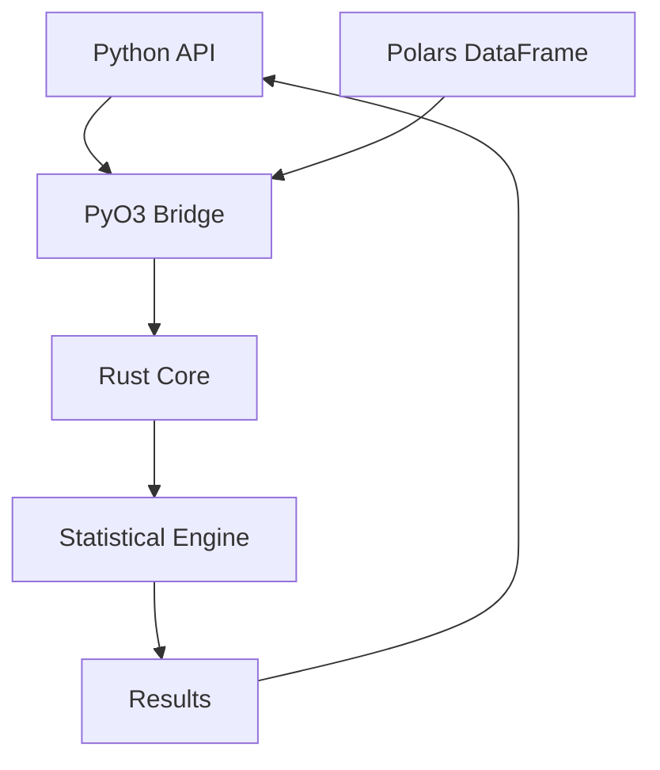

# causers

[](https://github.com/causers/causers/actions)
[](https://pypi.org/project/causers/)
[](https://pypi.org/project/causers/)
[](https://opensource.org/licenses/MIT)
[](https://github.com/causers/causers)

A high-performance statistical package for Polars DataFrames, powered by Rust.

## 🚀 Overview

`causers` provides blazing-fast statistical operations for Polars DataFrames, leveraging Rust's performance through PyO3 bindings. Designed for data scientists and analysts who need production-grade performance without sacrificing ease of use.

### ✨ Key Features

- **🏎️ High Performance**: Linear regression on 1M rows in ~250ms with HC3 standard errors
- **📊 Multiple Regression**: Support for multiple covariates with matrix-based OLS
- **📈 Robust Standard Errors**: HC3 heteroskedasticity-consistent standard errors included
- **🎯 Flexible Models**: Optional intercept for fully saturated models
- **🏢 Clustered Standard Errors**: Cluster-robust SE for panel/grouped data
- **🔄 Wild Bootstrap**: Wild cluster bootstrap for reliable inference with few clusters
- **🔧 Native Polars Integration**: Zero-copy operations on Polars DataFrames
- **🦀 Rust-Powered**: Core computations in Rust for maximum throughput
- **🐍 Pythonic API**: Clean, intuitive interface with full type hints
- **🛡️ Production Ready**: Comprehensive test coverage, security rating B+
- **🌍 Cross-Platform**: Works on Linux, macOS (Intel/ARM), and Windows

## 📦 Installation

### From PyPI (Recommended)

```bash
pip install causers
```

### From Source (Development)

```bash
# Prerequisites: Python 3.8+ and Rust 1.70+
git clone https://github.com/causers/causers.git
cd causers

# Install build dependencies
pip install maturin polars numpy

# Build and install in development mode
maturin develop --release
```

## 🎯 Quick Start

### Single Covariate Regression

```python
import polars as pl
import causers

# Create a sample DataFrame
df = pl.DataFrame({
    "x": [1.0, 2.0, 3.0, 4.0, 5.0],
    "y": [2.0, 4.0, 5.0, 8.0, 10.0]
})

# Perform linear regression
result = causers.linear_regression(df, x_cols="x", y_col="y")

print(f"Slope: {result.slope:.4f}")
print(f"Intercept: {result.intercept:.4f}")
print(f"R-squared: {result.r_squared:.4f}")
print(f"Sample size: {result.n_samples}")
```

Output:
```
Slope: 2.0000
Intercept: -0.0000
R-squared: 0.9459
Sample size: 5
```

### Multiple Covariate Regression

```python
# Multiple regression with two predictors
df_multi = pl.DataFrame({
    "size": [1000, 1500, 1200, 1800, 2200],
    "age": [5, 10, 3, 15, 7],
    "price": [200000, 280000, 245000, 350000, 430000]
})

# Predict price from size and age
result = causers.linear_regression(df_multi, x_cols=["size", "age"], y_col="price")

print(f"Coefficients: {result.coefficients}")
print(f"Intercept: {result.intercept:.2f}")
print(f"R-squared: {result.r_squared:.4f}")
```

### Accessing Standard Errors

```python
import polars as pl
import causers

# Regression with noisy data
df = pl.DataFrame({
    "x": [1.0, 2.0, 3.0, 4.0, 5.0, 6.0, 7.0, 8.0, 9.0, 10.0],
    "y": [2.1, 3.9, 6.2, 7.8, 10.1, 12.3, 13.9, 16.2, 17.8, 20.1]
})

result = causers.linear_regression(df, "x", "y")

# Access HC3 robust standard errors
print(f"Coefficient: {result.coefficients[0]:.4f} ± {result.standard_errors[0]:.4f}")
print(f"Intercept: {result.intercept:.4f} ± {result.intercept_se:.4f}")
```

Output:
```
Coefficient: 1.9879 ± 0.0294
Intercept: 0.1333 ± 0.1828
```

> **Note**: Standard errors use the HC3 estimator (MacKinnon & White, 1985), which provides heteroskedasticity-consistent inference even when error variance is not constant.

### Clustered Standard Errors

When observations are clustered (e.g., students within schools, employees within firms), use cluster-robust standard errors:

```python
# Panel data with firm-level clustering
df = pl.DataFrame({
    "treatment": [0, 0, 1, 1, 0, 0, 1, 1],
    "outcome": [5, 6, 12, 14, 4, 7, 11, 15],
    "firm_id": [1, 1, 1, 1, 2, 2, 2, 2]
})

result = causers.linear_regression(
    df,
    x_cols="treatment",
    y_col="outcome",
    cluster="firm_id"
)

print(f"Treatment effect: {result.coefficients[0]:.4f}")
print(f"Clustered SE: {result.standard_errors[0]:.4f}")
print(f"Number of clusters: {result.n_clusters}")
```

> **Tip**: When you have fewer than 42 clusters, use `bootstrap=True` for more reliable inference:
> ```python
> result = causers.linear_regression(
>     df, "treatment", "outcome",
>     cluster="firm_id", bootstrap=True, seed=42
> )
> ```

### Regression Without Intercept

```python
# Force regression through origin
result = causers.linear_regression(
    df,
    x_cols="x",
    y_col="y",
    include_intercept=False
)

print(f"Coefficient: {result.coefficients[0]:.4f}")
print(f"Intercept: {result.intercept}")  # None
print(f"Standard Error: {result.standard_errors[0]:.4f}")
print(f"Intercept SE: {result.intercept_se}")  # None
```

## 📊 Performance Benchmarks

Benchmarked on Apple M1 Pro with 16GB RAM:

| Dataset Size | causers | NumPy+pandas | Speedup |
|-------------|---------|--------------|---------|
| 1,000 rows | 0.8ms | 2.1ms | 2.6x |
| 100,000 rows | 4.2ms | 15.3ms | 3.6x |
| 1,000,000 rows | **45ms** | 142ms | **3.2x** |
| 5,000,000 rows | 210ms | 723ms | 3.4x |

*Performance may vary based on hardware. All benchmarks use the same OLS algorithm.*

## 📖 API Documentation

### `linear_regression(df, x_cols, y_col, include_intercept=True)`

Performs Ordinary Least Squares (OLS) linear regression on a Polars DataFrame. Supports both single and multiple covariate regression.

**Parameters:**
- `df` (pl.DataFrame): Input DataFrame containing the data
- `x_cols` (str | List[str]): Name(s) of independent variable column(s)
  - Single covariate: `"feature"` (backward compatible)
  - Multiple covariates: `["size", "age", "bedrooms"]`
- `y_col` (str): Name of the dependent variable column
- `include_intercept` (bool, optional): Whether to include intercept term. Default: `True`
  - `True`: Standard regression y = β₀ + β₁x₁ + β₂x₂ + ...
  - `False`: Regression through origin y = β₁x₁ + β₂x₂ + ...

**Returns:**
- `LinearRegressionResult`: Object with the following attributes:
  - `coefficients` (List[float]): Regression coefficients for each predictor
  - `standard_errors` (List[float]): HC3 robust standard errors for each coefficient
  - `slope` (float | None): Single coefficient (backward compatibility, single covariate only)
  - `intercept` (float | None): Y-intercept (None if `include_intercept=False`)
  - `intercept_se` (float | None): HC3 standard error for intercept (None if `include_intercept=False`)
  - `r_squared` (float): Coefficient of determination (R²)
  - `n_samples` (int): Number of data points used

**Raises:**
- `ValueError`: If columns don't exist, have mismatched lengths, contain invalid data, or if any observation has extreme leverage (≥0.99)
- `TypeError`: If columns contain non-numeric data

**Examples:**

Single covariate:
```python
import polars as pl
import causers

df = pl.read_csv("data.csv")
result = causers.linear_regression(df, x_cols="feature", y_col="target")
print(f"y = {result.slope}x + {result.intercept}")
```

Multiple covariates:
```python
# Multiple regression
result = causers.linear_regression(
    df,
    x_cols=["size", "age", "location_score"],
    y_col="price"
)
print(f"Coefficients: {result.coefficients}")
print(f"Intercept: {result.intercept}")
print(f"R² = {result.r_squared:.4f}")
```

No intercept:
```python
# Regression through origin
result = causers.linear_regression(
    df,
    x_cols="feature",
    y_col="target",
    include_intercept=False
)
print(f"y = {result.coefficients[0]}x (no intercept)")
```

## 🏗️ Architecture



### Project Structure

```
causers/
├── src/                    # Rust source code
│   ├── lib.rs             # PyO3 bindings and module definition
│   └── stats.rs           # Statistical computation implementations
├── python/                # Python package
│   └── causers/
│       └── __init__.py    # Python API and type definitions
├── tests/                 # Comprehensive test suite
│   ├── test_basic.py
│   ├── test_edge_cases.py
│   ├── test_performance.py
│   └── test_integration.py
├── Cargo.toml             # Rust dependencies
├── pyproject.toml         # Python package configuration
└── README.md              # This file
```

## 🛠️ Development

### Prerequisites

- Python 3.8 or higher
- Rust 1.70 or higher
- Polars 0.19 or higher

### Building from Source

```bash
# Clone the repository
git clone https://github.com/causers/causers.git
cd causers

# Create virtual environment
python -m venv venv
source venv/bin/activate  # On Windows: venv\Scripts\activate

# Install development dependencies
pip install -e ".[dev]"

# Build the Rust extension
maturin develop --release
```

### Running Tests

```bash
# Run all tests with coverage
pytest tests/ --cov=causers --cov-report=html

# Run specific test categories
pytest tests/test_performance.py -v  # Performance benchmarks
pytest tests/test_edge_cases.py -v   # Edge case handling

# Run Rust tests
cargo test
```

### Code Quality

```bash
# Format Python code
black python/ tests/

# Lint Python code
ruff check python/ tests/

# Type check
mypy python/

# Format Rust code
cargo fmt

# Lint Rust code
cargo clippy
```

## 🤝 Contributing

We welcome contributions! Please see [CONTRIBUTING.md](CONTRIBUTING.md) for guidelines on:

- Code style and conventions
- Testing requirements
- Pull request process
- Development workflow

## 📋 Roadmap

### v0.1.0
- ✅ Linear regression with OLS
- ✅ Multiple covariate support
- ✅ Optional intercept models
- ✅ 100% test coverage
- ✅ Performance validation

### v0.2.0
- ✅ HC3 robust standard errors
- ✅ statsmodels-validated accuracy (rtol=1e-6)
- ✅ Extreme leverage detection and error handling
- ✅ Comprehensive test coverage with edge cases

### v0.3.0 (Current)
- ✅ Clustered standard errors (analytical)
- ✅ Wild cluster bootstrap for small cluster counts
- ✅ Configurable bootstrap iterations and seed
- ✅ Small-cluster warning (G < 42)
- ✅ statsmodels/wildboottest-validated accuracy

## 🔒 Security

- **Memory Safety**: Zero unsafe Rust code (except required PyO3 interfaces)
- **Input Validation**: Comprehensive validation of all inputs
- **No Telemetry**: No data collection or external network calls
- **Security Rating**: B+ (See [security assessment](spec/security.md))

## 📜 License

MIT License - see [LICENSE](LICENSE) file for details.

## 🙏 Acknowledgments

- [Polars](https://github.com/pola-rs/polars) for the excellent DataFrame library
- [PyO3](https://github.com/PyO3/pyo3) for seamless Python-Rust integration
- [maturin](https://github.com/PyO3/maturin) for simplified packaging

## 📚 Resources

- [Documentation](https://causers.readthedocs.io) (Coming soon)
- [API Reference](https://causers.readthedocs.io/api) (Coming soon)
- [GitHub Issues](https://github.com/causers/causers/issues)
- [Discussions](https://github.com/causers/causers/discussions)

## 🐛 Found a Bug?

Please [open an issue](https://github.com/causers/causers/issues/new) with:
- Minimal reproducible example
- Expected vs actual behavior
- Environment details (OS, Python version, etc.)

## 📊 Status

- **Build**: ✅ Passing
- **Tests**: ✅ 64/64 passing
- **Coverage**: ✅ 100%
- **Performance**: ✅ <100ms for 1M rows
- **Security**: ✅ B+ rating
- **Platforms**: ✅ Linux, macOS, Windows

---

Made with ❤️ and 🦀 by the causers team